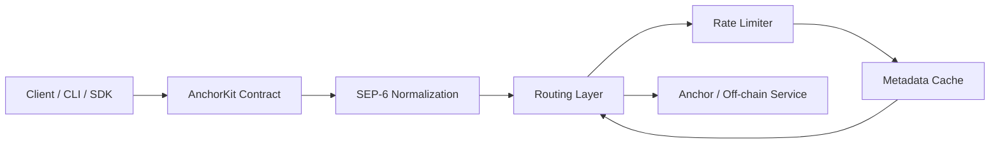

# AnchorKit Architecture

This document explains how the core AnchorKit components interact, including the typical data flow for a deposit operation.

## Component Interaction

AnchorKit is designed as a layered integration stack. A typical deposit request passes through the following components:

- **Client / CLI / SDK**: The user-facing entry point that creates requests.
- **AnchorKit Contract**: The core contract logic and on-chain validation layer.
- **SEP-6 Normalization**: A service layer that adapts anchor deposit/withdrawal responses to a canonical shape.
- **Routing**: Selects the correct anchor endpoint for the requested asset/service.
- **Rate Limiter**: Protects anchor backends by throttling or delaying requests.
- **Metadata Cache**: Stores anchor capabilities, limits, and discovery data for fast reuse.

### Mermaid diagram



### ASCII diagram

```
Client / CLI / SDK
        |
        v
AnchorKit Contract
        |
        v
SEP-6 Normalization
        |
        v
Routing Layer
        |
        v
Rate Limiter
        |
        v
Metadata Cache
        |
        v
Anchor / Off-chain Service
```

## Deposit data flow

1. The client sends a deposit request, including asset, amount, subject, and optional metadata.
2. The AnchorKit contract validates the request and prepares the canonical service call.
3. The SEP-6 normalization layer maps the request and the anchor response into a stable `DepositResponse` shape.
4. The routing layer selects the best anchor endpoint for the requested asset and service.
5. The rate limiter evaluates the request using configured thresholds and may delay or reject traffic.
6. The metadata cache provides cached anchor capabilities, fee limits, and service availability to improve routing decisions.
7. The request is forwarded to the anchor service.
8. The anchor response is normalized, validated, and returned to the client.

## Why this matters

This architecture separates transport logic from business rules and makes AnchorKit easier to extend:

- **Contract** handles state and policy.
- **SEP-6** ensures service responses are normalized.
- **Routing** selects the correct endpoint.
- **Rate limiting** protects backend anchors.
- **Caching** improves performance and avoids repeated discovery.

## Module Reference

All source modules and their responsibilities:

| Module | File | Responsibility |
|---|---|---|
| Module declarations | `src/lib.rs` | Re-exports public APIs and declares all `mod` entries; contains no business logic |
| Core contract | `src/contract.rs` | On-chain entry points, attestor registration, attestation submission and retrieval, and inline timestamp replay protection (`check_timestamp`) |
| Storage | `src/storage.rs` | Persistent key/value storage helpers and TTL management |
| Events | `src/events.rs` | Contract event definitions emitted on every state change |
| Types | `src/types.rs` | Shared data structures used across modules |
| Errors | `src/errors.rs` | `AnchorKitError`, stable `ErrorCode` values (100-120), and the `Error` alias |
| SEP-6 | `src/sep6.rs` | Normalized deposit/withdrawal service layer; adapts anchor responses to a canonical `DepositResponse`/`WithdrawalResponse` shape |
| Rate limiter | `src/rate_limiter.rs` | Per-attestor sliding-window rate limiting to prevent spam and abuse |
| Retry | `src/retry.rs` | Configurable exponential-backoff retry logic for off-chain anchor requests |
| Domain validator | `src/domain_validator.rs` | HTTPS-only URL validation for anchor domain inputs before any outbound request |
| Response validator | `src/response_validator.rs` | Schema validation for anchor API responses; rejects responses with missing required fields |
| Transaction state tracker | `src/transaction_state_tracker.rs` | Tracks deposit/withdrawal lifecycle states (Pending → InProgress → Completed/Failed) |
| SEP-10 JWT | `src/sep10_jwt.rs` | Minimal Ed25519 / EdDSA JWT verification for SEP-10 anchor authentication tokens |
| Deterministic hash | `src/deterministic_hash.rs` | Canonical payload hashing used for off-chain ↔ on-chain attestation matching |

### Module interaction summary

```
Client request
    │
    ▼
contract.rs          ← on-chain entry point; calls storage, events, types, errors
    │
    ├── domain_validator.rs   validates anchor URL before any outbound call
    ├── sep6.rs               normalises deposit/withdrawal responses
    │       └── retry.rs      retries failed off-chain requests with backoff
    ├── rate_limiter.rs       enforces per-attestor submission limits
    ├── response_validator.rs checks that anchor API responses are well-formed
    ├── transaction_state_tracker.rs  tracks transaction lifecycle
    ├── sep10_jwt.rs          verifies SEP-10 Ed25519 JWT tokens
    └── deterministic_hash.rs produces canonical hashes for attestation matching
```

## Storage Layout

All contract state is managed via the `StorageKey` enum defined in `src/storage.rs`. This section documents every variant and its corresponding storage layer.

### DataKey Enum Variants

#### Attestor Management
| Variant | Storage | Type | Description |
|---------|---------|------|-------------|
| `Sep10Key(Address)` | Persistent | `Bytes` | SEP-10 JWT verification key for an attestor; used for cryptographic signature validation |
| `Attestor(Address)` | Persistent | `bool` | Registration flag; `true` indicates the address is a registered attestor |
| `AttestorRevoked(Address)` | Persistent | `bool` | Revocation marker; present when attestor has been revoked; used to populate `issuer_revoked` in attestation responses |
| `AttestorCount` | Instance | `u64` | Running count of registered attestors; used for statistics and pagination |
| `Endpoint(Address)` | Persistent | `String` | HTTPS endpoint URL for an attestor's discovery or metadata service |
| `PerAttestorCount(Address)` | Persistent | `u64` | Per-attestor attestation count; tracks total attestations submitted by a specific attestor |

#### Attestation Records
| Variant | Storage | Type | Description |
|---------|---------|------|-------------|
| `Attest(u64)` | Persistent | `Attestation` | Complete attestation record indexed by attestation ID |
| `SubjectCount(Address)` | Persistent | `u64` | Per-subject attestation count; used for pagination and statistics |
| `SubjectAttestation(Address, u64)` | Persistent | `u64` | Per-subject attestation index entry; maps subject + index → attestation ID for efficient retrieval |
| `AttestationRevoked(u64)` | Persistent | `bool` | Revocation marker for an individual attestation; marks a specific attestation as revoked |
| `Used(Bytes)` | Persistent | `bool` | Replay-protection flag; marks a payload hash as consumed to prevent duplicate submissions |

#### Session Management
| Variant | Storage | Type | Description |
|---------|---------|------|-------------|
| `Session(u64)` | Persistent | `Session` | Complete session record indexed by session ID; tracks initiator and state |
| `SessionOpCount(u64)` | Persistent | `u64` | Operation count within a session; incremented on each session operation for audit logging |

#### Audit Logging
| Variant | Storage | Type | Description |
|---------|---------|------|-------------|
| `AuditLog(u64)` | Persistent | `AuditLog` | Audit log entry indexed by log ID; tracks all administrative and operational actions |
| `AuditLogMaxSize` | Instance | `u64` | Configuration: maximum number of audit log entries to retain before pruning oldest entries |

#### Quotes & Pricing
| Variant | Storage | Type | Description |
|---------|---------|------|-------------|
| `Quote(Address, u64)` | Persistent | `Quote` | Quote record indexed by (anchor address, quote ID); contains exchange rate and validity window |
| `LatestQuote(Address)` | Persistent | `u64` | Latest quote ID for an anchor; used to auto-increment quote IDs per anchor |

#### Anchor Services & Metadata
| Variant | Storage | Type | Description |
|---------|---------|------|-------------|
| `Services(Address)` | Persistent | `AnchorServices` | Supported services record for an anchor; lists available deposit/withdrawal endpoints |
| `Health(Address)` | Persistent | `HealthStatus` | Health status snapshot for an anchor; tracks latency, failure count, and availability |
| `AnchorMeta(Address)` | Persistent | Metadata object | Routing and operational metadata for an anchor; used for intelligent request routing |
| `AnchorJurisdiction(Address)` | Persistent | `String` | ISO 3166-1 alpha-3 jurisdiction code for an anchor; used for regulatory compliance and geographic routing |

#### Caching (Temporary Storage)
| Variant | Storage | Type | Description |
|---------|---------|------|-------------|
| `MetadataCache(Address)` | Temporary | `AnchorMetadata` | Cached anchor metadata with embedded TTL; expires after configured duration |
| `CapabilitiesCache(Address)` | Temporary | `CapabilitiesCache` | Cached SEP-24 capabilities from anchor's `/info` endpoint; avoids repeated discovery |
| `TomlCache(Address)` | Temporary | `StellarToml` | Cached `stellar.toml` entries for an anchor; stored in temporary storage for performance |
| `Span(Bytes)` | Temporary | `TracingSpan` | Tracing span keyed by request-ID bytes; used for distributed tracing and request correlation |

#### Rate Limiting
| Variant | Storage | Type | Description |
|---------|---------|------|-------------|
| `RateLimitState(Address)` | Persistent | Sliding-window state | Per-attestor rate-limit state; contains submission count and current window start timestamp |
| `RateLimitOverride(Address)` | Persistent | Configuration object | Per-attestor rate-limit configuration override; allows custom thresholds per attestor |

#### Configuration & Instance State
| Variant | Storage | Type | Description |
|---------|---------|------|-------------|
| `MaxPageSize` | Instance | `u32` | Configuration: maximum allowed page size for list operations (e.g., `list_attestations`) |
| `IsPaused` | Instance | `bool` | Contract pause state; when `true`, most contract operations are blocked for emergency situations |

### Instance Storage Keys (Vec<Symbol>)

The following keys are stored in instance storage as `Vec<Symbol>` because Soroban's instance storage requires this key type:

| Key | Type | Description |
|-----|------|-------------|
| `ADMIN` | `Address` | Current contract administrator; single address with elevated privileges |
| `COUNTER` | `u64` | Global attestation counter; incremented on each new attestation submission |
| `SCNT` | `u64` | Session counter; incremented on each new session creation |
| `QCNT` | `u64` | Quote counter; incremented on each new quote submission |
| `ACNT` | `u64` | Audit log counter; incremented on each audit log entry |
| `AOFF` | `u64` | Audit log offset; tracks the starting index of retained audit entries (for pruning) |
| `ANCHLIST` | `Vec<Address>` | List of all anchor addresses currently being tracked |
| `ATTESTLIST` | `Vec<Address>` | List of all registered attestor addresses; enables enumeration via pagination |
| `HTHRESH` | `u32` | Health failure threshold; number of consecutive failures before anchor deactivation |
| `RPWINDOW` | `u64` | Replay-attack detection window in seconds; defines acceptable timestamp tolerance |

### Storage Layers

AnchorKit uses three Soroban storage layers:

- **Persistent**: Long-term state (90-day TTL). Use for attestations, sessions, audit logs, and configuration.
- **Temporary**: Short-term cache (24-hour TTL for spans, 30-day for other entries). Use for metadata caches and tracing spans.
- **Instance**: Contract-instance state. Use for global configuration and administrative counters.

### Accessing Storage

All storage access goes through the `StorageKey` enum. To read or write:

1. **Get**: `env.storage().persistent().get::<_, Type>(&key)` or `.temporary()` or `.instance()`
2. **Set**: `env.storage().persistent().set(&key, &value)`
3. **Extend TTL**: `env.storage().persistent().extend_ttl(&key, ttl, min_ttl)`

See `src/storage.rs` for the complete enum definition and helper functions.
